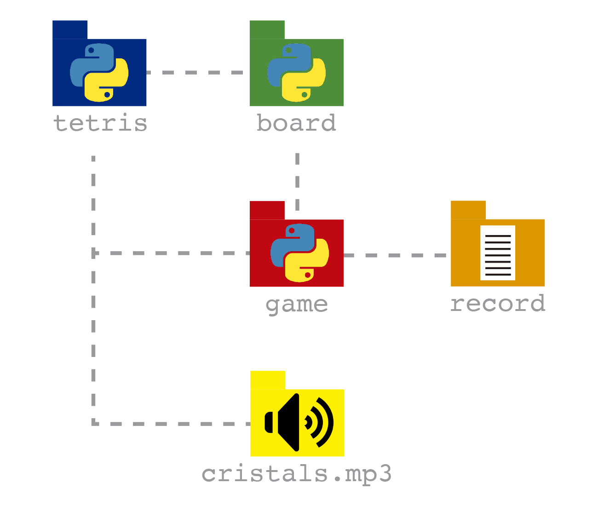

<div style="text-align:center">

</div>

----
###### Proyecto de [Jouad](https://github.com/Jouad01) y [Noe](https://github.com/noecrespi)
# Índice

1. [Introducción](#introducción)
1. [Objetivos del proyecto](#objetivos-del-proyecto)
1. [Requisitos](#requisitos)
1. [Planificación](#planificación)
1. [Analisis](#analisis)
    1. [Posibles tecnologías](#posibles-tecnologías)
1. [Diseño](#diseño)
    1. [Diagrama de componentes](#diagrama-de-componentes)
1. [Creación del documento IDC](#creación-del-documento-idc)
1. [Creación del documento TEP](#creación-del-documento-tep)
1. [¿Cómo jugar?](#cómo-jugar)
1. [Interacción del jugador con el juego](#interacción-del-jugador-con-el-juego)
1. [Cosas a tener en cuenta](#cosas-a-tener-en-cuenta)
1. [¿Cómo se genera las piezas?](#¿cómo-se-genera-las-piezas?)
1. [¿Cómo sabe si se hace linea?](#¿cómo-sabe-si-se-hace-linea?)
1. [¿Cuando acaba el juego?](#¿cuando-acaba-el-juego?)
1. [Esquema BBDD](#esquema-bbdd)
1. [¿Cómo sabe que es la máxima puntución?](#cómo-sabe-que-es-la-máxima-puntución)
1. [Creación del documento CCF](#creación-del-documento-ccf)
1. [Implementación](#implementación)
    1. [Tecnologías utilizadas](#tecnologías-utilizadas)
1. [Creación del documento PCE](#creación-del-documento-pce)

# Introducción
El tetris es un juego de piezas o elementos diferentes que deben encajar entre si.

El objetivo es hacer caer piezas e ir rellenando huecos para conseguir hacer líneas. Una vez creadas, desaparecen, y nos interesa hacerlo de cuatro en cuatro en vez de una en una por los puntos que hay implicados en ello. Si consigues una de cuatro, felicidades, acabas de hacer un Tetris.

1. Descargar el repositorio de GitHub.
2. Abrir el archivo `Tetris.py` con el editor de texto de tu preferencia.
3. Descargar el pygame de la página oficial.
4. Ejecutar el archivo `Tetris.py` con el intérprete de Python.
5. Poner nombre al jugador.
6. Se abrirá una ventana con el tablero de juego.
7. Clicar cualquier tecla para empezar a jugar.
8. Se creará una pieza aleatoria. Podremos moverla con las flechas del teclado ⬅️ ⬆️ ⬇️ ➡️.
9. A jugar!

# Objetivos del proyecto

- Trabajo en equipo.    
- Aplicar los conocimientos adquiridos en clase en un proyecto real.
- Aprender a trabajar con un repositorio remoto y local en equipo.

# Requisitos 
- Incrementar un sistema workflow en git.
- Documentar el manual técnico de la aplicación.

# Planificación
Antes de iniciar el proyecto hemos realizado una planificación y lo hemos dividido en 4 fases:
- IDC, Investigación y desarrollo conceptual.
- TEP, Traslado a entorno de programa.
- CCF, Codificación y creación de funciones.
- PCE, Pruebas y corrección de errores.

# Analisis 
## Posibles tecnologías
| Tecnologías | _workflow_ | BBDD |
|-| - | - | 
| MongoDB |  - | ✅ |
| GitHub | ✅ | - |

# Diseño
## Diagrama de componentes


Este proyecto se compone de un archivo principal llamado `tetris`. En este se accede a multiples funciones que son llamadas a cada una de ellas(`board`, `game` y `cristals`).

El archivo `board` contiene las constantes del juego, como las piezas, el tamaño del tablero, cómo caen las piezas y el color de las piezas. 

El archivo `game` contiene las funciones del juego, como dibujar el tablero, dibujar las piezas, la puntuación, cómo selecciona la pieza de forma aleatoria, guarda la máxima puntuación del jugador, etc.

El audio del juego se encuentra en el archivo `cristals`.

`Record` es el archivo donde se guarda la máxima puntuación del jugador.


# Creación del documento IDC

El tetris es un juego de piezas o elementos diferentes que deben encajar entre si.

El objetivo es hacer caer piezas e ir rellenando huecos para conseguir hacer líneas. Una vez creadas, desaparecen, y nos interesa hacerlo de cuatro en cuatro en vez de una en una por los puntos que hay implicados en ello. Si consigues una de cuatro, felicidades, acabas de hacer un Tetris.

1. Descargar el repositorio de GitHub.
2. Abrir el archivo `Tetris.py` con el editor de texto de tu preferencia.
3. Descargar el pygame de la página oficial.
4. Ejecutar el archivo `Tetris.py` con el intérprete de Python.
5. Poner nombre al jugador.
6. Se abrirá una ventana con el tablero de juego.
7. Clicar cualquier tecla para empezar a jugar.
8. Se creará una pieza aleatoria. Podremos moverla con las flechas del teclado ⬅️ ⬆️ ⬇️ ➡️.
9. A jugar!

# Creación del documento TEP

Preparación
1. Descargar el pygame de la página oficial.
2. Crear un archivo `Tetris.py` con el editor de texto de tu preferencia, ese será el archivo principal del juego (el main).
3. Crear un archivo `board.py` ese será el archivo donde guardaremos las constantes del juego, en este caso las piezas del jugo, como caen .
4. Crear un archivo `game.py` ese será el archivo donde guardaremos las funciones del juego, tales como el tablero, las piezas, la puntuación,  etc.
5. Crear un archivo `record.txt` ese será el archivo donde se guarda la mejor puntuación del juego.
6. Crear un archivo `README.md` ese será el archivo donde se guardará la documentación del proyecto.

# ¿Cómo jugar?
1. Irán bajando por el tablero las piezas de forma aleatoria con una función llama `random`.
2. El jugador podrá mover las piezas con las flechas del teclado ⬅️ ⬆️ ⬇️ ➡️.
    - El jugador podrá mover las piezas a la derecha con la tecla ➡️ .
    - El jugador podrá mover las piezas a la izquierda con la tecla ⬅️  .
    - El jugador podrá rotar las piezas con la tecla  ⬆️ .
    - El jugador podrá bajar las piezas con la tecla  ⬇️ .

# Interacción del jugador con el juego

1. Se mostrará por termnal el nombre del juego.
2. Se mostrará por terminal el que el usuario debe introducir su nombre.
3. Se abrirá una ventana y el jugador clicará cualquier tecla para empezar a jugar.
4. Iniciará el juego.
5. Durante todo el juego se mostrará en pantalla la pieza del siguiente turno. 
5. Cada vez que 'caiga' una pieza comprobara si hay una línea completa.
    - Si hay una línea completa, se sumará 10 puntos a la puntuación.
    - Si no, seguirá bajando las piezas.
6. Cuando las piezas lleguen arriba(de forma vertical) el juego acaba y sale en pantalla **'GAME OVER'**

# Cosas a tener en cuenta 
Si el usuario sale antes de que salga el 'GAME OVER' no se guarda la puntuación.


# ¿Cómo se genera las piezas?

Las piezas están definidas en el archivo `board.py`. 
Cada pieza esá definida en una lista y en esa lista tiene varias sublistas. Eso es porque cada  pieza tiene varias formas:
- Pieza normal, clasica 
- Pieza rotada


###### Código de las piezas con sus imágenes

Todas las piezas están metidas en una lista 
```py
shapes = [S, Z, I, O, J, L, T]
```

Y los colores de cada una de ellas está en otra lista 
```py
shape_colors = [(0, 255, 0), (255, 0, 0), (0, 255, 255), (255, 255, 0), (255, 165, 0), (0, 0, 255), (128, 0, 128)]
```

El archivo `game` pide las piezas del archivo board:
- Clase `Piece` crea las piezas
- Función `convert_shape_format`: coge una pieza como argumento y devuelve una lista de coordenadas de las celtas que no son ceros. 
- Función `draw_next_shape`: dibuja la pieza en el tablero.

El archivo `tetris` usa los archivos del `board` y del `game`. El cual regorre la pieza y le asigna el color de la pieza.


# ¿Cómo sabe si se hace linea?
Hay una función que se llama `clean_row` que comprueba si hay una línea completa, si la hay, se elimina o sea si no hay ninguna pieza en negro(color del tablero) sabe que se ha hecho una linea. 

Algoritmo de la función `clean_row`:

1. Se le pasa un diccionario  que almacena las piezas y una lista de listas que representa el tablero.
1. Inicializar un contador  para las filas completas.
1. Recorrer el tablero.
    1. Si no hay ningún bloque vacio en la fila aumentará el contador de filas completas.
    1.  Guardar el índice de la fila completa.
    1. Eliminar la posicion de la fila completa del diccionario de posiciones bloqueadas
1. Si el contador es mayor a 0.
    1. Recorrer las posiciones bloqueadas y ordenadas por coordenadas 
        1. Si hay alguna fila que se encuentre por encima de la fila completa
            1. Mover la posición bloqueada en el número de filas completas hacia abajo.


###### `clean_row`

# ¿Cuando acaba el juego?
Se acaba la partida cuando se llena el tablero de alto con las piezas  o cuando de clica en la barra espaciadora. 

# Esquema BBDD

El esquema de la base de datos esta organizada en dos colecciones, una para los jugadores y otra para los records.

###### Validación esquema

```js 
{
    $jsonSchema: {
        bsonType: 'object',
        required: [
            'nombre',
            'puntuacion',
        ],
        properties: {
            nombre: {
                bsonType: 'string',
                description: 'nombre del jugador'
            },
            puntuacion: {
                bsonType: 'int',
                description: 'puntuacion del jugador'
            },
        }
    }
}
```


# ¿Cómo sabe que es la máxima puntución?
Hay un archivo que se llama `records.py` que se encarga de guardar la máxima puntuación en un archivo txt.
```py
if check_lost(locked_positions):
# Insertar datos en la base de datos
    puntuaciones.insert_one({ "nombre": nombre, "puntuacion": score})
    draw_text_middle(win, 'GAME OVER', 80, (255,255,255))
    pygame.display.update()
    pygame.time.delay(1500)
    run = False
    update_score(score)
    
    # se actualiza el ultimo puntaje si es mas alto
    if score > last_score:
        last_score = score
    while True:
        for event in pygame.event.get():
            if event.type == pygame.QUIT:
                pygame.display.quit()
```
# Creación del documento CCF
Lo primero hemos creado un [borrador](https://github.com/Jouad01/ProyectoPython-Tetris/blob/main/Borrador/notas.txt) con todas las prestaciones e ideas del juego.

Orden cronológico de los archivos creados:
1. `board`:archivo que contiene las variables globales.
    - Variables: 
        - Dimendisones del tablero.
        - Posicion del tablero(`x`, `y`).
        - Formas de las piezas (`S`, `Z`, `I`, `O`, `J`, `L`, `T`).
    - Listas:
        - Todas las piezas.
        - Colores de las piezas.

2. `game`: archivo que contiene las funciones del juego.
    - Librerias utilizadas:
        - `pygame`: libreria para crear el juego.
        - `random`: libreria para elegir una pieza aleatoria.
    - Archivos importados:
        - `board`: archivo que contiene las variables globales.
    - Clase:
        - `Piece`: clase que crea las piezas.
    - Funciones:
        - `create_grid`: crea el tablero.
        - `convert_shape_format`: convierte la forma de la pieza en una lista de coordenadas.
        - `valid_space`: comprueba si la pieza se puede colocar en el tablero.
        - `check_lost`: comprueba si se ha perdido la partida, es decir si se ha llenado de piezas el tablero de forma vertical.
        - `get_shape`: elige una pieza aleatoria usando la libreria `random`.
        - `draw_text_middle`: dibuja el texto en el centro de la pantalla.
        - `draw_grid`: dibuja la cuadricula del tablero en la pantalla.
        - `clear_rows`: elimina las filas completas, encontramos algun uso de lambda.
        - `draw_next_shape`: dibuja la siguiente pieza en la pantalla.
        - `update_score`: actualiza la puntuación en el fichero `records.txt`, siempre que sea mayor que la puntuación anterior.
        - `max_score`: lee el fichero `records.txt` y devuelve la puntuación máxima.
        - `draw_window`: dibuja la ventana del juego (puntuación, fondo, tamaño, color...), usando la libreria `pygame`.

3. `tetris`: archivo que contiene el bucle principal del juego.
    - Librerias utilizadas:
        - `pygame`: libreria para crear el juego.
        - `pymongo`: libreria para conectar con la base de datos mongoDB.
    - Modulos importados de pygame:
        - `pygame.locals`: para usar en el jugo las teclas del teclado.
        - `mixer`: para reproducir sonidos durante el juego.
    - Archivos importados:
        - `board`: archivo que contiene las variables globales.
        - `game`: archivo que contiene las funciones del juego.
    - Funciones:
        - `main`: bucle principal del juego.
            - Guarda las posiciones de las piezas caidas en un diccionario.
            - Reloj para controlar los fps (fotogramas por segundo).
            - Cargar el archivo de música y lo reproduce en bucle.
            - Conectar con la BBDD, el cual se entcuentra un prueba y error (`try` y `except`).
            - Mientras el programa se esté ejecutando:
                - Contrlar el tiempo de caida de las piezas y que caigan en el tiempo adecuado.
                - Aumentar la velocidad de caida de las piezas según el tiempo.
                - Controlar el cierre del juego.
                    - Controlar las teclas del teclado para mover y rotar las piezas.
            - Asignar la posicion de la pieza en la lista. 
            - Recorrer la pieza y asignar un color a cada una de las piezas.
            - Recorrer la posición de la pieza y se agrega cada una de ellas al diccionario.
                - Aumentar la puntuación por cada fila eliminada.
            - Insertar el nombre y la puntuación en la base de datos.
                - Actualizar la puntuación máxima si la nueva puntuación es mayor.
        - `main_menu`: menu principal del juego.
            - Inicializar el juego.
    - Otros:
        - Pide al usuario un nombre para guardar en la base de datos el nombre y la puntuación.

# Implementación

## Tecnologías utilizadas
### **MongoDB**

El **MongoDB** es un sistema de base de datos NoSQL, orientado a documentos y de código abierto.

### **GitHub**

El **GitHub** es una forja para alojar proyectos utilizando el sistema de control de versiones Git. Lo hemos
utilizado esta plataforma para almacenar nuestro proyecto en la nube y además hemos utilizado la rama de github
pages para hostear nuestra web en la red.

### **Python**

Python es un lenguaje de programación interpretado cuya filosofía hace hincapié en la legibilidad de su código.​ Se trata de un lenguaje de programación multiparadigma, ya que soporta parcialmente la orientación a objetos, programación imperativa y, en menor medida, programación funcional.

## **Herramientas utilizadas**

### **VsCode**

El **VsCode** es un editor de código fuente (IDE) utilizado para desarrollar el código fuente. El cual podemos 
usar las herramientas como conventional commits, live Share, git graph, Python.

### **Git**

El **Git** es un software de control de versiones. En nuestro caso hemos utilizado Git como sistema de versionado
de código para compartir y trabajar sobre nuestra aplicación y para mantener un registro de los cambios realizados.

### **Pygame**

El **Pygame** es una biblioteca de Python que permite crear videojuegos. Nosotros hemos utilizado esta biblioteca para crear el juego.

**Random**

El **Random** es un módulo de Python que nos permite generar números aleatorios.


# Creación del documento PCE

Nosotros hemos optado en hacer [TDD (Test Driven Development)]() y hemos creado las pruebas unitarias e integradas antes de crear el código. 

Por otra parte, hemos probado el codigo con el método *user story* (historias de usuario), es decir, nosotros hemos testeado de forma manual el código, para comprobar que todo funcionaba correctamente.

Aún así los errores que hemos encontrado durante el desarrollo del proyecto son los siguientes:

**Fallo:** Queriamos añadir el el fichero `records.txt` la puntuación y el nombre del jugador. 
**Solución:** Crear una base de datos en mongoDB y guardarlos en ella.

**Fallo:** El fichero `records.txt` no se guardaba la puntuación máxima.
**Solución:** Meter un numero en el fichero un numero para inicializar la puntuación máxima.

**Fallo:** No se visualizaba bien la pantalla del juego.
**Solución:** Buscar información de pantallas y que resolución se visualizaba mejor.

**Fallo:** No se visualizaba bien las piezas del juego.
**Solución:** Buscar información de las piezas y modificar las coordenadas de las piezas para mejorar su visualización.

**Fallo:** Las piezas se salian del tablero.
**Solución:** Poner condiciones para que las piezas no se salieran del tablero.

**Fallo:** No podiamos elimiar las filas completas.
**Solución:** Hacer un contador y controlar si la fila esta pintada de color que no sea negro.

**Fallo:** No se colocaba el texto en el centro de la pantalla.
**Solución:** Calcular y jugar con los valores de las coordenadas para que el texto se colocara en el centro de la pantalla.


Aún asi nos ha costado encontrar algunas soluciones ya que toda la información y ejemplos que encontrabamos estaban hechos con clases, cosa que este trabajo no estaba permitido por el profesor(a pesar de eso, nos ha dejado usar una clase, para poder llevar a cabo el proyecto). 

